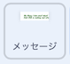

## プロジェクトをアップグレードする

時間があるなら、プロジェクトをアップグレードできます。 あなたはすでに何を追加するかについてのアイデアを持っているかもしれません！

こんなことができます：

+ 見た目、音、動きのブロックをつかい、メッセージやおやつのアニメーションをもっとすごくする
+ すきなおやつの画像（がぞう）を見つけて、**おやつ** のスプライトに追加する
+ ピニャータをたたいたときに出てくるおやつの数をふやす
+ ピニャータをわるためのたたく回数を変えることで、プロジェクトのむずかしさを変える

--- task ---
### ためしてみよう
<div style="display: flex; flex-wrap: wrap">
<div style="flex-basis: 175px; flex-grow: 1">  
背景にもコードを追加できることを知っている？

ピニャータがわれると、背景はどうなりますか？ どのブロックがこの効果（こうか）をつくっている？ 

[コードを参照](https://scratch.mit.edu/projects/680789589/){:target="_blank"}

</div>
<div class="scratch-preview" style="margin-left: 15px;">
  <iframe allowtransparency="true" width="485" height="402" src="https://scratch.mit.edu/projects/embed/680789589/?autostart=false" frameborder="0"></iframe>
</div>
</div>
--- /task ---

--- task ---

メッセージが決めておいた場所にたどり着いたとき、メッセージを`ずっと`{:class="block3control"} 変化させるコードを追加することができます。 `大きさを変える`{:class="block3looks"} や`色の効果を変える`{:class="block3looks"} ブロックをつかって、パーティービートに合わせてメッセージが動いているように見せることもできます：



```blocks3
when I receive [パーティー v]
show
repeat (20)
change size by (5)
change y by (-10)
end
+ forever
change size by (20) // 大きくしていくために正の数をいれる
change [color v] effect by (25) // 色をかえる
wait (0.5) seconds // 音楽にあわせて数をかえてください
change size by (-20) // 小さくしていくために負の数をいれる
```

[コードを参照](https://scratch.mit.edu/projects/680790352/){:target="_blank"}

<div class="scratch-preview" style="margin-left: 15px;">
  <iframe allowtransparency="true" width="485" height="402" src="https://scratch.mit.edu/projects/embed/680790352/?autostart=false" frameborder="0"></iframe>
</div>

--- /task ---

--- collapse ---
---
title: 完成したプロジェクト
---

[完成したプロジェクトはこちら](https://scratch.mit.edu/projects/680781531/){:target="_blank"}で確認できます。

--- /collapse ---

--- task ---

### プロジェクトを投稿する

すでにプロジェクトを私たちとシェアしている場合は、変更を保存するだけで、すばらしいアップグレードが反映されます。

まだシェアしていないけど、あなたのプロジェクトを ['Party piñata — Community' Scratchコミュニティ](https://scratch.mit.edu/studios/31111242){:target="_blank"}に投稿して他の人に見てもらいたい場合は、 [このフォーム](https://form.raspberrypi.org/f/community-project-submissions){:target="_blank"}を使ってください。

--- /task ---
