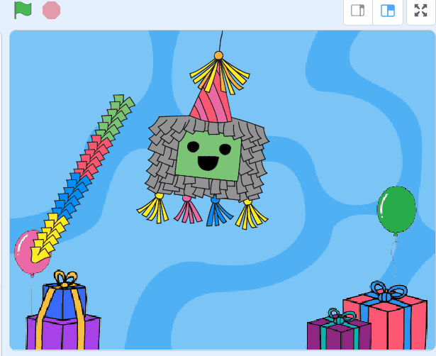
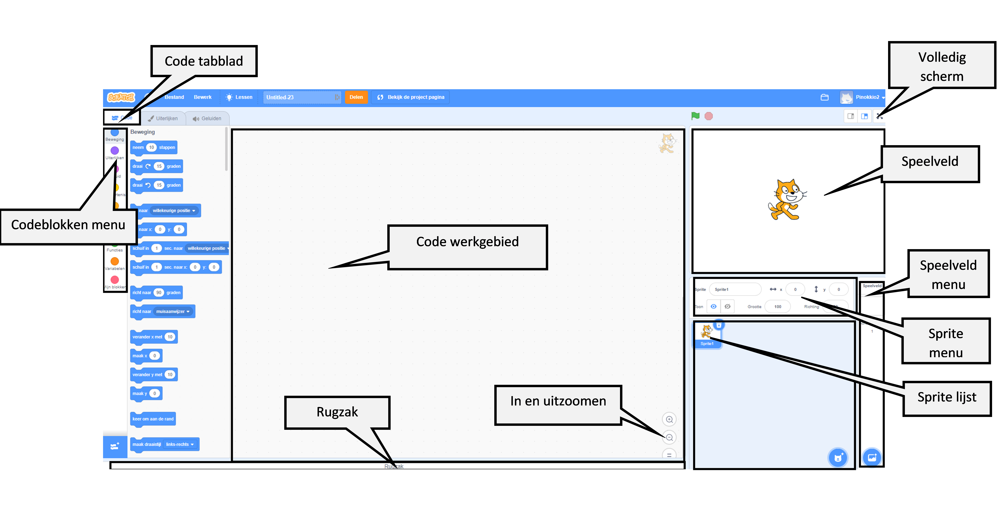
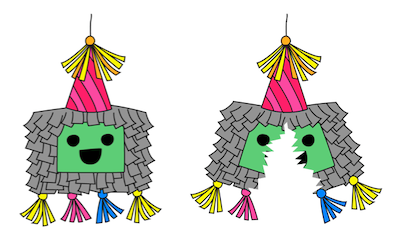
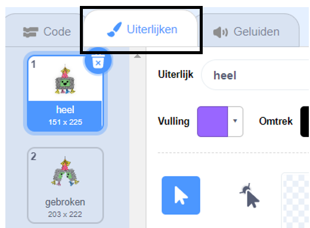
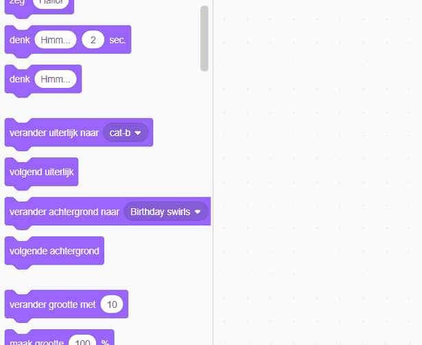
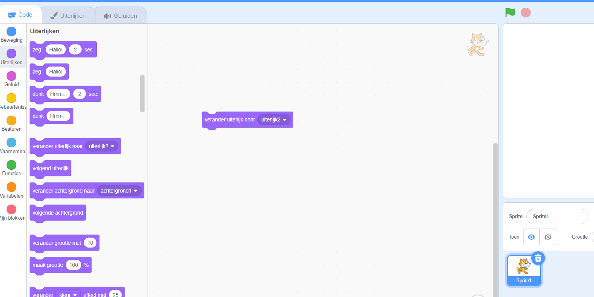
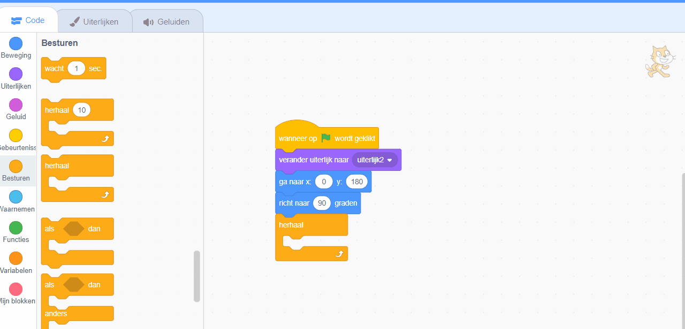

## Begin het feest

<div style="display: flex; flex-wrap: wrap">
<div style="flex-basis: 200px; flex-grow: 1; margin-right: 15px;">
In deze stap kies je een piñata uiterlijk en programmeer je de piñata om te slingeren.
</div>
<div>
{:width="300px"}
</div>
</div>

--- task ---

Open het [Feest piñata startproject](https://scratch.mit.edu/projects/653082997/editor){:target="_blank"}. Scratch wordt in een nieuw browsertabblad geopend.

[[[Offline werken]]]

--- /task ---

De Scratch-editor ziet er als volgt uit:



Het **Speelveld** is waar je project wordt uitgevoerd en een **achtergrond** verandert de manier waarop het Speelveld eruitziet. Er is een Code Club feestachtergrond voor je toegevoegd.

In Scratch worden karakters en objecten **sprites** genoemd en verschijnen ze op het Speelveld. Je kunt de **Piñata** en **Stick** sprites in het speelveld zien.


Op dit moment gebeurt er niet veel op dit feest. Dat kun jij veranderen!

--- task ---

Een sprite kan code, uiterlijken en geluiden hebben om de manier waarop hij eruitziet en wat hij doet, te veranderen.

Klik op de **Piñata** sprite in de Sprite-lijst en klik vervolgens op het **Uiterlijken** tabblad. Er zijn twee piñata uiterlijken, één met de naam 'heel' en de andere met de naam 'gebroken'.





--- /task ---

--- task ---

Klik op het **Code** tabblad. Ga naar de `Uiterlijken`{:class="block3looks"} blokken en sleep een `verander uiterlijk naar`{:class="block3looks"} blok naar het codegebied.

Klik op de naam van het uiterlijk om een **vervolgkeuze menu** te openen en selecteer vervolgens het `heel`{:class="block3looks"} uiterlijk:


```blocks3
verander uiterlijk naar (heel v) // Verander naar 'heel'
```



--- /task ---

Blokken kunnen in het codegebied met elkaar worden verbonden om er meer dan één te laten werken. Verbonden blokken worden van boven naar beneden uitgevoerd.

--- task ---

Sleep een `wanneer op de groene vlag wordt geklikt`{:class="block3events"} blok uit het `Gebeurtenissen`{:class="block3events"} blokkenmenu en verbind het met de bovenkant van je uiterlijken blok in het codegebied. De blokken zullen in elkaar klikken:


```blocks3
+ wanneer op de groene vlag wordt geklikt
verander uiterlijk naar (heel v)
```


--- /task ---

De startpositie van een piñata is altijd hetzelfde, hij komt pas in beweging als het piñataspel klaar is om te spelen.

--- task ---

Zoek in het `Beweging`{:class="block3motion"} blokkenmenu het `ga naar x: 0 y: 180`{:class="block3motion"} blok en het `richt naar 90 graden`{:class="block3motion"} blok. Sleep de blokken naar het codegebied en verbind ze met de onderkant van je code:


```blocks3
wanneer op de groene vlag wordt geklikt
verander uiterlijk naar (heel v)
+ ga naar x: (0) y: (180)
+ richt naar (90) graden // Start positie
```

--- task ---

Een `herhaal`{:class="block3control"} lus voert de codeblokken daarbinnen telkens opnieuw uit. Het is de perfecte lus voor een zwaaiende piñata die moeilijk te raken is.

--- task ---

Sleep een `herhaal`{:class="block3control"} blok uit het `Besturen`{:class="block3control"} blokkenmenu en verbind het met de onderkant van je code:


```blocks3
wanneer op de groene vlag wordt geklikt
verander uiterlijk naar (heel v)
ga naar x: (0) y: (180)
richt naar (90) graden
+ herhaal
```

--- /task ---

Een `herhaal`{:class="block3control"} lus kan worden gebruikt om de **Piñata** sprite een kleine beweging vele malen te laten herhalen. Hierdoor lijkt het of de piñata geanimeerd is.

--- task ---

Sleep een `herhaal 10`{:class="block3control"} blok naar het codegebied en bevestig het in je `herhaal`{:class="block3control"} lus.

Ga naar het `Beweging`{:class="block3motion"} blokkenmenu en sleep een `draai rechtsom 15 graden`{:class="block3motion"} blok in het `herhaal`{:class="block3control"} blok.

Verander de `15`{:class="block3motion"} graden in `1`{:class="block3motion"} graden zodat de piñata elke keer maar een klein beetje zwaait:


```blocks3
wanneer op de groene vlag wordt geklikt
verander uiterlijk naar (heel v)
ga naar x: (0) y: (180)
richt naar (90) graden
herhaal
+ herhaal (10) 
draai rechtsom (1) graden // Verander naar 1
```


--- /task ---

--- task ---

**Test:** Voer je project uit door op de **groene vlag** boven het speelveld te klikken om de piñata te zien slingeren.

**Mmm, er klopt iets niet!** Wanneer een object aan het plafond wordt gehangen, zal het niet alleen in één richting draaien, maar heen en weer zwaaien.

Stop je project door op het **rode stoppictogram** boven het speelveld te klikken.


--- /task ---

--- task ---

Voeg code toe aan je `herhaal`{:class="block3control"} lus toe zodat de piñata continu als een slinger vanuit het midden heen en weer zwaait:


```blocks3
wanneer op de groene vlag wordt geklikt
verander uiterlijk naar (heel v)
ga naar x: (0) y: (180)
richt naar (90) graden
herhaal
herhaal (10) //Zwaait 10 graden met de klok mee vanaf het midden
draai rechtsom (1) graden
einde
+ herhaal (20) // Zwaait 20 graden tegen de klok in door het midden
draai linksom (1) graden // Verander naar 1
einde
+ herhaal (10) // Zwaait 10 graden met de klok mee terug naar het midden
draai rechtsom (1) graden // Verander naar 1
einde
```

--- /task ---

--- task ---

**Test:** Voer je code uit om de piñata te zien zwaaien.

**Debuggen:** Als de piñata niet correct zwaait:
+ Kijk naar je code om er zeker van te zijn dat de `herhaal`{:class="block3control"} blokken op de juiste positie staan
+ Controleer of de `draai rechtsom graden`{:class="block3motion"} en `draai linksom graden`{:class="block3motion"} pijlen correct zijn
+ Zorg ervoor dat je de getallen uit de bovenstaande code hebt gebruikt


--- /task ---

--- save ---

