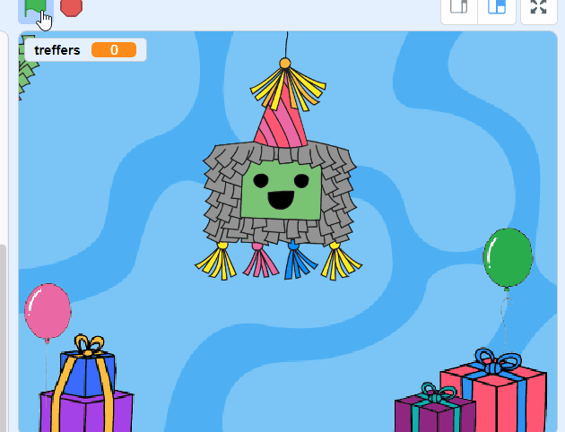
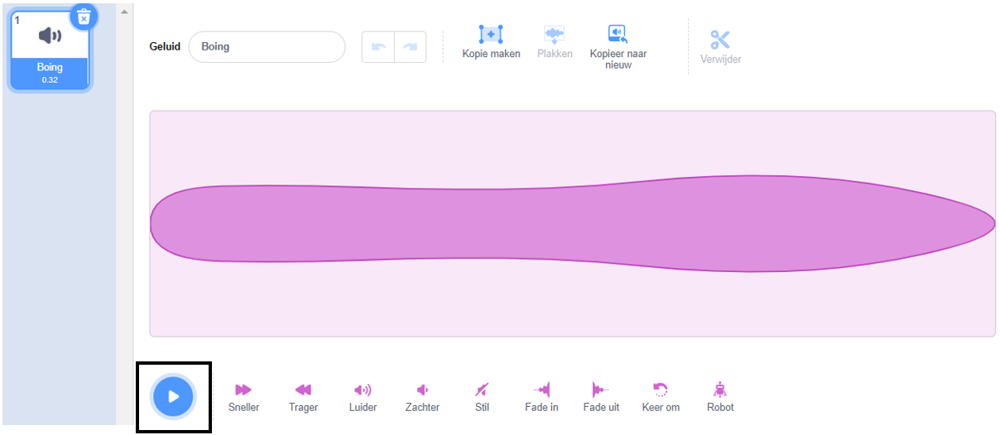
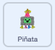
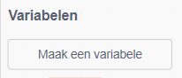
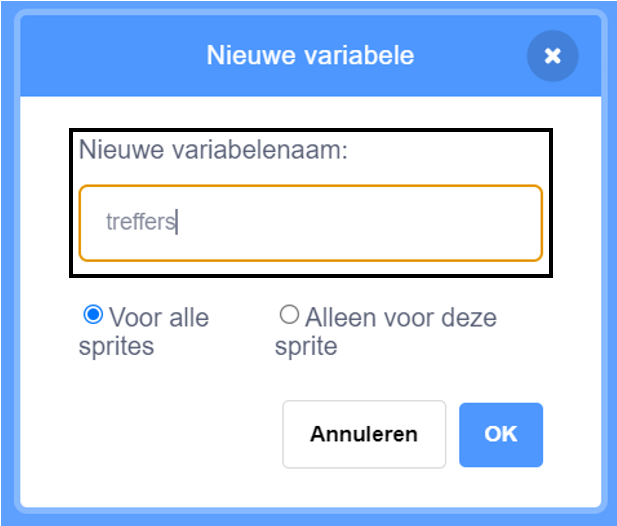
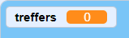
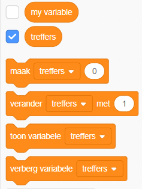
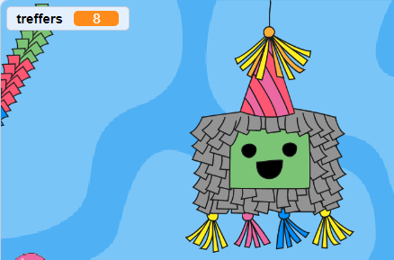
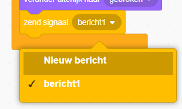
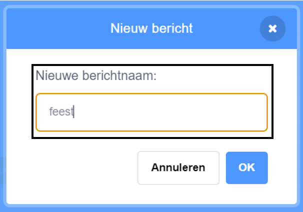

## Raak de piñata

<div style="display: flex; flex-wrap: wrap">
<div style="flex-basis: 200px; flex-grow: 1; margin-right: 15px;">
In deze stap programmeer je de piñata om een geluid af te spelen en tel je één treffer elke keer dat er op de piñata wordt geklikt.
</div>
<div>
{:width="300px"}
</div>
</div>

--- task ---

Klik op de **Geluiden** tab voor de **Piñata** sprite en je zult een **Boing** geluid vinden. Klik op de **Spelen** knop zodat je het geluid kunt horen.



--- /task ---

Een groep verbonden blokken in Scratch wordt een **script** genoemd. Sprites kunnen meer dan één script hebben.

--- task ---

Klik op het tabblad **Code**. Sleep uit `Gebeurtenissen`{:class="block3events"} een `wanneer op deze sprite wordt geklikt`{:class="block3events"} blok naar het codegebied om een nieuw script te starten.

Zoek bij de `Geluid`{:class="block3sound"} blokken het blok `start geluid`{:class="block3sound"}. Sleep het onderaan het `wanneer op deze sprite wordt geklikt`{:class="block3events"} blok:



```blocks3
wanneer op deze sprite wordt geklikt
start geluid [Boing v]
```

--- /task ---

--- task ---

**Test:** Voer je project uit door op de **groene vlag** boven het speelveld te klikken. Klik op de piñata terwijl deze zwaait om het boing-geluid te horen.

--- /task ---

Een `variabele`{:class="block3variables"} is een manier om getallen en/of tekst op te slaan. Het aantal keren dat er op de piñata wordt geklikt, wordt opgeslagen in een variabele met de naam `treffers`{:class="block3variables"}, zodat deze op elk moment kan worden gebruikt.

--- task ---

Klik op het `Variabelen`{:class="block3variables"} blokkenmenu en selecteer de **Maak een variabele** knop.



Noem je nieuwe variabele **treffers**:



**Opmerking:** De nieuwe 'treffers'-variabele verschijnt in het speelveld en kan nu worden gebruikt in de `variabele`{:class="block3variables"} blokken.





--- /task ---

--- task ---

Elke keer dat het project start, moet het aantal `treffers`{:class="block3variables"} worden teruggezet naar `0`{:class="block3variables"}.

Sleep het `maak treffers 0`{:class="block3variables"} blok naar het eerste script in het codegebied, tussen het `verander uiterlijk naar`{:class="block3looks"} blok en het `ga naar x: ( 0) y: (180)`{:class="block3motion"} blok.

Je code zou er als volgt uit moeten zien:


```blocks3
wanneer op de groene vlag wordt geklikt
verander uiterlijk naar (heel v)
+ maak [treffers v] (0)
ga naar x: (0) y: (180)
richt naar (90) graden
herhaal
herhaal (10)
draai rechtsom (1) graden
einde
herhaal (20)
draai linksom (1) graden
einde
herhaal (10)
draai rechtsom (1) graden
einde
```

--- /task ---

--- task ---

Elke keer dat er op de **Piñata** sprite wordt geklikt, moet het aantal `treffers`{:class="block3variables"} toenemen.

Voeg een blok toe om `treffers`{:class="block3variables"} met `1`{:class="block3variables"} te wijzigen wanneer op de **Piñata** sprite wordt geklikt:


```blocks3
wanneer op deze sprite wordt geklikt
start geluid [Boing v]
+ verander [treffers v] met (1)
```

--- /task ---

--- task ---

**Test: ** Voer je project een paar keer uit. Controleer of `treffers`{:class="block3variables"} altijd begint bij `0`{:class="block3variables"} en elke keer met `1`{:class="block3variables"} toeneemt als je op de **Piñata** klikt.



--- /task ---

Een piñata is moeilijk te breken, maar gaat niet eeuwig mee. Je piñata gaat `10 treffers`{:class="block3variables"} mee voordat hij openbreekt.

Een `als`{:class="block3control"} blok kan worden gebruikt om een beslissing te nemen op basis van een **voorwaarde**.

<p style="border-left: solid; border-width:10px; border-color: #0faeb0; background-color: aliceblue; padding: 10px;">
We gebruiken altijd <span style="color: #0faeb0">**voorwaarden**</span> om beslissingen te nemen. We zouden kunnen zeggen: "Als het potlood bot is, dan slijp je het". `Als` blokken en voorwaarden laten ons code schrijven die iets anders doet, afhankelijk van of een voorwaarde waar of onwaar is.
</p>

--- task ---

Ga naar het `Besturen`{:class="block3control"} blokkenmenu. Sleep een `als`{:class="block3control"} blok naar het codegebied en plaats het rond de blokken in je `wanneer deze sprite wordt geklikt`{:class="block3events"} script:


```blocks3
wanneer op deze sprite wordt geklikt
+ als <> dan
start geluid [Boing v]
verander [treffers v] met (1)

```

--- /task ---

Het `als`{:class="block3control"} blok heeft een zeshoekige invoer waar je een voorwaarde kunt inbouwen.

--- task ---

De **Piñata** sprite moet een geluid afspelen en het aantal `treffers`{:class="block3variables"} verhogen **`als`{:class="block3control"}** het aantal `treffers`{:class="block3variables"} `minder is dan`{:class="block3operators"} `10`{:class="block3variables"}.

Voeg eerst een `<`{:class="block3operators"} functie toe aan de zeshoekige invoer:


```blocks3
wanneer op deze sprite wordt geklikt
+ als <() < ()> dan
start geluid [Boing v]
verander [treffers v] met (1)

```

--- /task ---

--- task ---

Voltooi het bouwen van de `als`{:class="block3control"} voorwaarde door de variabele `treffers`{:class="block3variables"} links van de operator `<`{:class="block3operators"} te slepen en de waarde '10' aan de rechterkant te typen:


```blocks3
wanneer op deze sprite wordt geklikt
+ als <(treffers) < (10)> dan
start geluid [Boing v]
verander [treffers v] met (1)

```

--- /task ---

--- task ---

**Test:** Voer je project weer uit. Klik 10 keer op de piñata om het geluid te horen en de variabele `treffers`{:class="block3variables"} te zien toenemen.

Sla nog een paar keer op de piñata. De variabele `treffers`{:class="block3variables"} zal niet hoger worden dan 10 omdat die voorwaarde niet langer 'waar' is, dus de code in het `als`{:class="block3control"} blok zal niet worden uitgevoerd.

--- /task ---

--- task ---

Voeg een tweede `als`{:class="block3control"} blok binnen het eerste toe. Deze keer controleert de voorwaarde of `treffers`{:class="block3variables"} `=`{:class="block3operators"} 10 en als dat 'waar' is zal het uiterlijk veranderen in `gebroken`{:class="block3looks"}:


```blocks3
wanneer op deze sprite wordt geklikt
als <(treffers) < (10)> dan
start geluid [Boing v]
verander [treffers v] met (1)
+ als <(treffers)=(10)> dan
verander uiterlijk naar (gebroken v)

```

--- /task ---

--- task ---

**Test:** Voer je project een paar keer uit. Controleer of de **Piñata** sprite begint met het 'hele' uiterlijk en vervolgens verandert in het 'gebroken' uiterlijk na `10 treffers`{:class="block3variables"}.


--- /task ---

Wanneer de sprite **Piñata** gebroken is, moeten alle andere sprites weten dat het feest is begonnen.

In Scratch kan het `signaal`{:class="block3events"} blok gebruikt worden om een bericht te **sturen** dat alle sprites kunnen **ontvangen**.

--- task ---

Zoek het `zend signaal` blok onder het `Gebeurtenissen`{:class="blocks3events"} blokkenmenu:


```blocks3
wanneer op deze sprite wordt geklikt
als <(treffers) < (10)> dan
start geluid [Boing v]
verander [treffers v] met (1)
als <(treffers)=(10)> dan
verander uiterlijk naar (gebroken v)
+ zend signaal (bericht1 v)
```

Klik op `bericht1`{:class="block3events"} en kies **'Nieuw bericht'**. Noem het nieuwe bericht `feest`{:class="blocks3events"}.





Je `zend signaal`{:class="block3events"} blok zal er zo uitzien:

```blocks3
zend signaal (feest v)
```

--- /task ---

--- save ---
