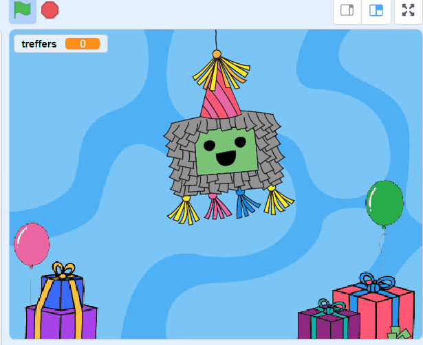
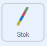
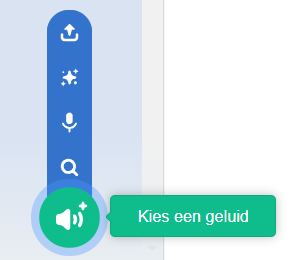
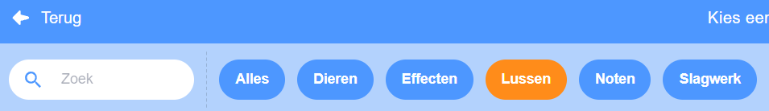
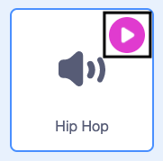
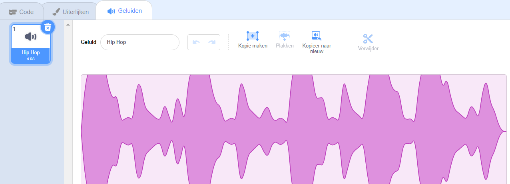

## Gebruik een stok

<div style="display: flex; flex-wrap: wrap">
<div style="flex-basis: 200px; flex-grow: 1; margin-right: 15px;">
Piñata's worden meestal geraakt met een stok van hout of dik karton dat is bedekt met kleurrijke stroken papier. In deze stap voeg je code toe om de stok te besturen en herhaalmuziek af te spelen wanneer de piñata breekt. 
</div>
<div>
{:width="300px"}
</div>
</div>

--- task ---

Klik op de **Stok** sprite in de Sprite-lijst. Voeg code toe zodat de stok altijd voor de andere sprites blijft en de muisaanwijzer (of je vinger op een tablet) volgt.

Gebruik het `ga naar willekurige positie`{:class="block3motion"} blok, maar selecteer `muisaanwijzer`{:class="block3motion"} in het vervolgkeuzemenu:



```blocks3
wanneer op de groene vlag wordt geklikt
herhaal
ga naar laag [voorgrond v]
ga naar (muisaanwijzer v) // Verander naar muisaanwijzer
```

--- /task ---

--- task ---

**Test:** Voer je project uit en controleer of de sprite **Stok** je cursor of vinger over het speelveld volgt.


--- /task ---

Er zijn veel verschillende soorten geluiden in Scratch, van stem- en dierengeluiden tot meer dan 100 andere geluidseffecten.

Scratch heeft ook **herhaalgeluiden** die kunnen worden gebruikt in een `herhaal`{:class="block3control"} of `herhaal tot`{:class="block3control"} lusen zodat het klinkt alsof ze continu worden afgespeeld.

--- task ---

Ga naar het **Geluiden** tabblad en klik op het **Kies een geluid** pictogram.



--- /task ---

--- task ---

Vanuit de **Kies een geluid** bibliotheek kies je de **Lussen** categorie.



--- /task ---

--- task ---

**Kies:** Beweeg over de **speel** iconen om de herhaalgeluiden te horen. Voeg je favoriet toe door erop te klikken.



Het geluid verschijnt dan in je lijst Geluiden:



--- /task ---

--- task ---

Klik op het tabblad **Code** en maak een nieuw script om het geluid `continue`{:class="block3control"} te herhalen wanneer het bericht `feest`{:class="block3events"} is ontvangen:


```blocks3
when I receive [party v]
forever
play sound [Hip Hop v] until done // Choose your sound
```

--- /task ---

--- task ---

**Test:** Run your project, and click on the piñata ten times to hear the looping party music.

--- /task ---

--- save ---
