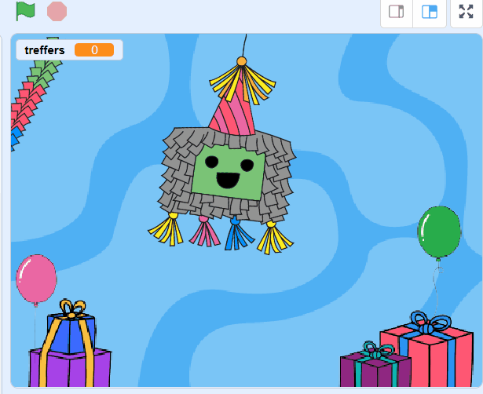

## Voeg wat snoep toe

<div style="display: flex; flex-wrap: wrap">
<div style="flex-basis: 200px; flex-grow: 1; margin-right: 15px;">
Piñata's zitten vol met snoep en als ze beginnen te breken, vallen het snoep eruit. In deze stap animeer je snoepjes van or de hele wereld die uit de piñata vallen telkens wanneer deze wordt geraakt. Herken je een van de lekkernijen?
</div>
<div>
{:width="300px"}
</div>
</div>

<p style="border-left: solid; border-width:10px; border-color: #0faeb0; background-color: aliceblue; padding: 10px;">
Een <span style="color: #0faeb0">**uiterlijk**</span> in Scratch is een afbeelding die het uiterlijk van een sprite verandert. Onze **grafische ontwerpers** vroegen leiders van Code Clubs over de hele wereld om hen te vertellen wat voor lekkers ze op een feestje zouden krijgen. Hopelijk zullen sommige van de snoepuiterlijken die ze hebben gemaakt bekend voor je zijn - en andere volledig nieuw.      
</p>

--- task ---

Klik op de **Snoep** sprite in de Sprite-lijst en klik vervolgens op het **Uiterlijken** tabblad.

Er zijn 26 snoepuiterlijken - en je gaat ze allemaal gebruiken!


--- /task ---

--- task ---

Klik op het tabblad **Code** en maak vervolgens een script om het snoep in de piñata `te verbergen`{:class="blocks3looks"} wanneer je project start:


```blocks3
wanneer op de groene vlag wordt geklikt
verdwijn
ga naar x: (0) y: (100)
```

--- /task ---

Elke keer dat de piñata wordt geraakt, ontsnappen er vier snoepjes aan de piñata. Door het **klonen** van de **Snoep** sprite, kun je meerdere traktaties maken.

<p style="border-left: solid; border-width:10px; border-color: #0faeb0; background-color: aliceblue; padding: 10px;">
Een <span style="color: #0faeb0">**kloon**</span> in Scratch is een kopie van een sprite. Het heeft helemaal dezelfde code, uiterlijken en geluiden van de originele sprite.      
</p>

--- task ---

Klik op de knop **Piñata** sprite.

Plaats een `herhaal`{:class="block3control"} lus in je bestaande script. Verander de waarde in `4`{:class="block3control"} en voeg dan een `maak een kloon van mijzelf`{:class="block3control"} toe. Gebruik het vervolgkeuzemenu om de sprite `Snop`{:class="block3control"} te selecteren:


```blocks3
wanneer op deze sprite wordt geklikt
als <(treffers) < (10)> dan
start geluid [Boing v]
verander [treffers v] met (1)
+ herhaal (4) //Verander naar 4
maak klook van (snoep v) //Selecteer Snoep
einde
als <(treffers)=(10)> dan
verander uiterlijk naar (gebroken v)
zend signaal (feest v)
```

**Tip:** Gebruik de vrije ruimte in het codegebied om je nieuwe code te bouwen en sleep deze vervolgens naar het bestaande script:

 --- task ---

--- task ---

Klik op de **Snoep** sprite.

Maak een nieuw script met het `wanneer ik als kloon start`{:class="block3control"} blok.

Voeg blokken toe uit het `Uiterlijken`{:class="block3looks"} blokkenmenu om het uiterlijk van elke nieuwe kloon te bepalen:


```blocks3
wanneer ik als kloon start
verschijn
ga naar laag [achertgrond v] // Verander naar achtergrond
verander uiterlijk naar (Knafeh v)
```

--- /task ---

--- task ---

Je kunt willekeurige snoepjes kiezen die worden vrijgegeven wanneer de piñata wordt geraakt. Gebruik een `willekeurig getal`{:class="block3operators"} operator om een willekeurig uiterlijk te selecteren van `1`{:class="block3operators"} tot `26`{:class="block3operators"} telkens wanneer een kloon wordt gemaakt:


```blocks3
wanneer ik als kloon start
verschijn
ga naar laag [achertgrond v] 
verander uiterlijk naar (willekeurig getal tussen (1) en (26)) // Verander naar 26
```

--- /task ---

--- task ---

Op dit moment verschijnen de **Snoep** klonen achter de **Piñata** -sprite, maar de snoepjes moeten van de piñata naar een willekeurige positie vallen.

Voeg code toe om de gekloonde **Snoep** sprites naar een willekeurige positie te laten `schuiven`{:class="block3motion"}:


```blocks3
wanneer ik als kloon start
verschijn
ga naar laag [achertgrond v] 
verander uiterlijk naar (willekeurig getal tussen (1) en (26))
+ schuif in (1) sec. naar (willekeurige positie v) 
```

--- /task ---

--- task ---

**Test:** Voer je project uit en klik op de piñata om na elke treffer vier klonen van de sprite **Snoep** te zien. De uiterlijken worden willekeurig gekozen en de snoepjes glijden elk naar een willekeurige positie.



--- /task ---

--- task ---

Voeg animatie toe om de **Snoep** klonen `continu`{:class="blocks3control"} `te laten draaien`{:class="block3motion"} wanneer ze hun willekeurige positie bereiken. Onthoud dat animaties het beste werken bij kleine bewegingen, dus verander het aantal graden in `1`{:class="block3motion"}:


```blocks3
wanneer ik als kloon start
verschijn
ga naar laag [achertgrond v] 
verander uiterlijk naar (willekeurig getal tussen (1) en (26))
+ schuif in (1) sec. naar (willekeurige positie v) 
+ herhaal
draai rechtsom (1) graden
```

--- /task ---

--- task ---

**Test:** Voer je project uit om de **Snoep** klonen te zien draaien.


--- /task ---

--- save ---
