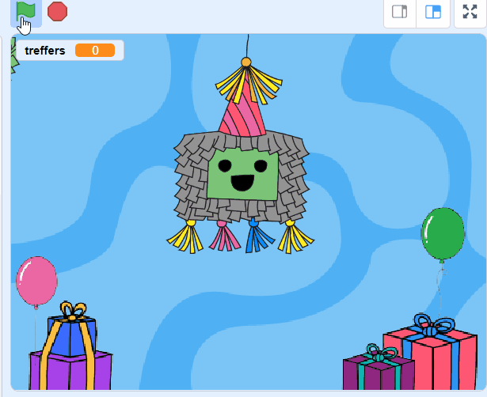
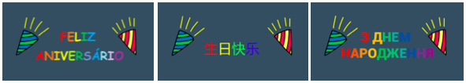
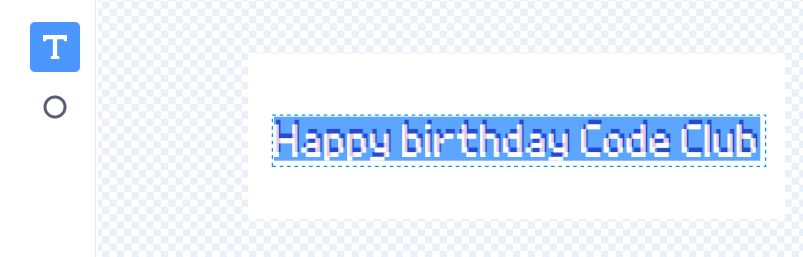
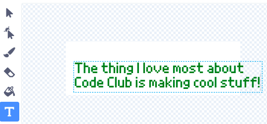
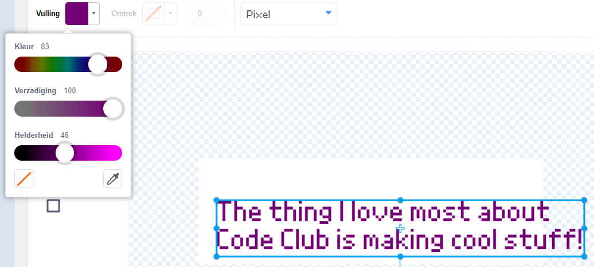
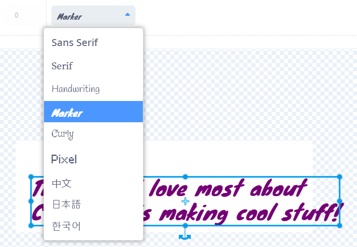
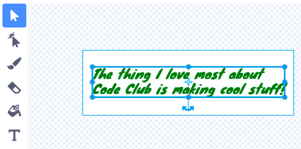

## Maak een bericht

<div style="display: flex; flex-wrap: wrap">
<div style="flex-basis: 200px; flex-grow: 1; margin-right: 15px;">
In deze stap schrijf je een bericht en animeer je het met bewegings- en kleureffecten. 
</div>
<div>
{:width="300px"}
</div>
</div>

Wat zou je op een verjaardagskaart schrijven om naar Code Club te sturen? Dat kan zijn:
+ Je favoriete ding over Code Club
+ Een bericht over je fantastische Code Club leider
+ Details van wat je vervolgens wilt maken met jouw programmeervaardigheden

<p style="border-left: solid; border-width:10px; border-color: #0faeb0; background-color: aliceblue; padding: 10px;">
De eerste Code Club projecten waren in het Engels geschreven, maar binnen een jaar waren ze vertaald in het Braziliaans-Portugees, Nederlands, Duits, Noors en Oekraïens. Franse, Griekse en Spaanse vertalingen volgden snel en nu zijn enkele van de Code Club projecten vertaald in <span style="color: #0faeb0">**28 moedertalen**</span>. Bedankt aan onze geweldige vertalers!


</p>

--- task ---

Klik op de **Bericht** sprite in de Sprite-lijst en klik vervolgens op het **Uiterlijken** tabblad.

Het uiterlijk heeft de tekst 'Happy Birthday Code Club'. Dubbelklik (of tik en houd vast op een tablet) op de tekst om de tekstbewerkingstool te selecteren.



--- /task ---

--- task ---

Je kunt nu je nieuwe Code Club verjaardagsbericht typen. Druk op **Enter** op je toetsenbord om een nieuwe regel te beginnen.

**Tip:** Maak je geen zorgen als je bericht een beetje te groot is voor de box, want je kunt het later verkleinen.



--- /task ---

--- task ---

**Kies:**Klik op het **Vulling** pictogram om het kleuren vervolgkeuzemenu te openen. Verplaats de vulschuifregelaars naar links of rechts om je favoriete kleur te selecteren.



--- /task ---

--- task ---

**Kies:** Klik op de tool **Lettertype** en er verschijnt een vervolgkeuzelijst met lettertypen. Het lettertype 'Pixel' is geselecteerd in het startproject, maar je kunt elk van de beschikbare lettertypen gebruiken.



--- /task ---

--- task ---

Klik op de tool **Selecteer** en er verschijnen acht cirkels rond je bericht. Gebruik deze cirkels om het formaat van je bericht te wijzigen door erop te klikken en ze binnen het witte vak te verslepen.



--- /task ---

Je bericht is klaar, nu kun je code toevoegen om je bericht in de piñata te verbergen en je bericht na de tiende treffer uit de piñata te laten vallen.

--- task ---

Klik op het tabblad **Code** en maak vervolgens een script om het bericht in de piñata `te verbergen`{:class="block3looks"} wanneer je project start:


```blocks3
when flag clicked
verdwijn
maak grootte (10) % // Verander naar 10 om klein te beginnen
ga naar x: (0) y: (100) // Binnenin de piñata
```

--- /task ---

--- task ---

Maak een nieuw script dat zal beginnen als het bericht `feest`{:class="block3events"} is ontvangen.

Voeg een `herhaal`{:class="block3control"} lus toe om het bericht te animeren. Het bericht zal `van grootte veranderen`{:class="block3looks"} om te groeien en de `y`{:class="block3motion"} positie veranderen om te vallen terwijl het animeert:


```blocks3
wanneer ik signaal [feest v] ontvang
verschijn
herhaal (20) // Verander naar 20
verander grootte met (5) // Verander naar 5
verander y met (-10) // Verander naar -10
```

--- /task ---

--- task ---

**Test:** Voer je project uit. Raak de piñata tien keer om de boodschap te zien vallen.


--- /task ---

--- save ---
