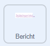

## Verbeter je project

Als je tijd hebt, kunt je jouw project verbeteren. Misschien heb je al ideeën over wat je kunt toevoegen!

Je zou:

+ Extra uiterlijken, geluiden of bewegingsblokken kunnen gebruiken om je bericht en traktaties verder te animeren
+ Afbeeldingen kunnen zoeken van je favoriete lekkernijen en ze toevoegen aan de uiterlijken voor de sprite **Snoep**
+ Het aantal snoepjes kunnen verhogen dat bij elke treffer uit de piñata valt
+ Je project gemakkelijker of moeilijker kunnen maken door het aantal keren te wijzigen dat je de piñata moet raken voordat deze breekt

--- task ---
### Probeer het uit
<div style="display: flex; flex-wrap: wrap">
<div style="flex-basis: 175px; flex-grow: 1">  
Wist je dat je ook code aan de achtergrond kunt toevoegen?

Wat gebeurt er met de achtergrond als de piñata breekt? Welke blokken zouden dit effect creëren? 

[Bekijk de code](https://scratch.mit.edu/projects/687987258/){:target="_blank"}

</div>
<div class="scratch-preview" style="margin-left: 15px;">
  <iframe allowtransparency="true" width="485" height="402" src="https://scratch.mit.edu/projects/embed/687987258/?autostart=false" frameborder="0"></iframe>
</div>
</div>
--- /task ---

--- task ---

Je zou code kunnen toevoegen om het bericht `continu`{:class="block3control"} te laten animeren wanneer het op zijn plek is. Gebruik `verander grootte`{:class="block3looks"} en `verander kleureffect`{:class="block3looks"} blokken zodat het lijkt alsof het bericht meebeweegt met de feestmuziek:



```blocks3
wanneer ik signaal [feest v] ontvang
verschijn
herhaal (20)
verander grootte met (5)
verander y met (-10)
einde
+ herhaal
verander grootte met (20) // Positief getal om te groeien
verander [kleur v] effect met (25) // Verander de kleur
wacht (0.5) sec. // Probeer verschillende getallen om bij de muziek te laten passen
verander grootte met (-20) // Negatief getal om te verkleinen
```

[Bekijk de code](https://scratch.mit.edu/projects/687987819/){:target="_blank"}

<div class="scratch-preview" style="margin-left: 15px;">
  <iframe allowtransparency="true" width="485" height="402" src="https://scratch.mit.edu/projects/embed/687987819/?autostart=false" frameborder="0"></iframe>
</div>

--- /task ---

--- collapse ---
---
title: Voltooid project
---

Je kunt het [voltooide project hier](https://scratch.mit.edu/projects/687981271/){:target="_blank"} bekijken.

--- /collapse ---

--- task ---

### Dien je project in

Als je je project al met ons hebt gedeeld, sla dan je wijzigingen op en we zullen je geweldige verbeteringen zien.

Als je jouw project nog niet gedeeld hebt, en het wil indienen bij onze ['Feest piñata — Community' Scratch studio](https://scratch.mit.edu/studios/31111242){:target="_blank"} zodat andere mensen het kunnen zien, vul dan [dit formulier](https://form.raspberrypi.org/f/community-project-submissions){:target="_blank"} in.

--- /task ---
